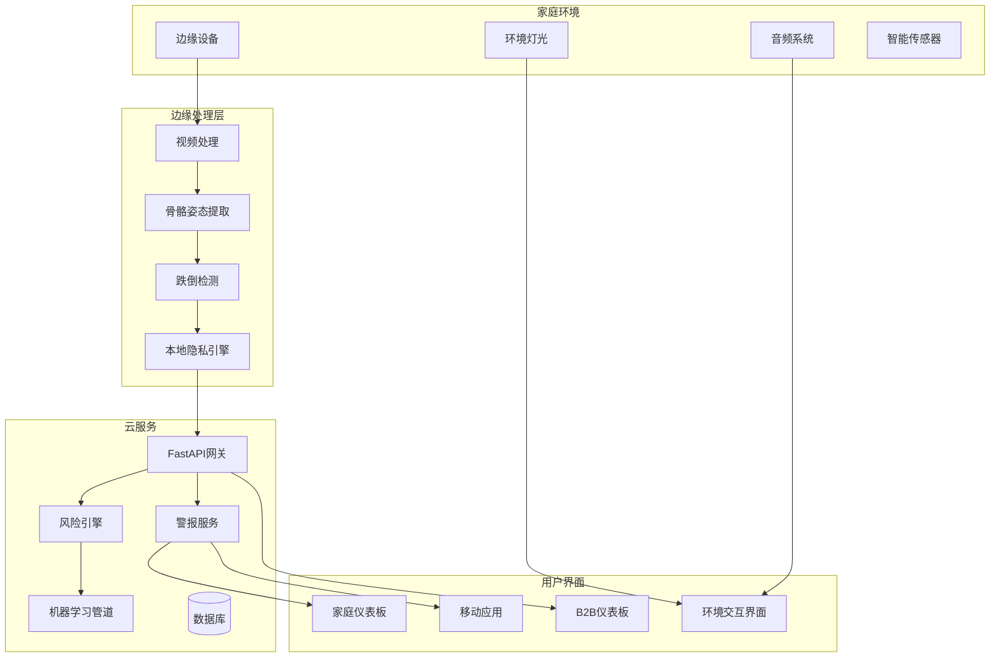

# 设计文档 - 银龄精算师老年人护理监控系统

## 概述

银龄精算师是一个隐私优先的老年人护理监控系统，结合边缘计算、计算机视觉AI和精算风险建模，为老年人提供全面的安全监控。系统架构通过本地处理优先保护隐私，通过边缘计算实现实时响应，通过云原生设计模式实现可扩展性。

系统服务三个主要用户群体：寻求独立与安全的老年人、希望安心的家庭成员，以及需要风险评估和管理工具的B2B客户（护理机构和保险公司）。

## 架构设计

### 高层架构



### 系统组件

**边缘计算层：**
- 使用YOLOv8 + OpenPose进行骨骼提取的本地视频处理
- 实时跌倒检测和异常识别
- 确保原始视频不离开设备的隐私引擎
- 本地数据缓冲和智能云同步

**云服务层：**
- 基于FastAPI的微服务架构，严格分层
- 具有时序分析的精算风险评估引擎
- 多模态警报编排和响应协调
- 持续模型改进的机器学习管道

**用户界面层：**
- Vue3 + Vite前端，使用TailwindCSS响应式设计
- 使用IoT灯光和音频系统的环境界面
- 面向家庭成员和护理人员的移动应用
- 面向机构和保险提供商的B2B仪表板

## 组件与接口

### 边缘设备组件

**目的：** 处理视频分析和隐私保护的本地处理单元

**核心类：**
```python
class EdgeProcessor:
    def __init__(self, camera_config: CameraConfig, privacy_config: PrivacyConfig)
    def process_video_stream(self) -> SkeletonData
    def detect_falls(self, skeleton_data: SkeletonData) -> FallEvent
    def ensure_privacy_compliance(self, data: Any) -> bool

class SkeletonExtractor:
    def __init__(self, model_path: str)
    def extract_pose(self, frame: VideoFrame) -> PoseKeypoints
    def anonymize_data(self, pose_data: PoseKeypoints) -> AnonymizedPose

class PrivacyEngine:
    def validate_data_transmission(self, data: Any) -> ValidationResult
    def encrypt_skeleton_data(self, skeleton_data: SkeletonData) -> EncryptedData
    def audit_privacy_compliance(self) -> ComplianceReport
```

**接口：**
- 支持多种视频格式的摄像头输入接口
- 到云服务的安全WebSocket连接
- 临时数据缓冲的本地存储接口
- 不同边缘计算平台的硬件抽象层

### 风险评估引擎

**目的：** 健康风险评估的精算建模和预测分析

**核心类：**
```python
class ActuarialRiskEngine:
    def __init__(self, model_registry: ModelRegistry)
    def calculate_frailty_index(self, activity_data: ActivityData) -> FrailtyScore
    def predict_incident_probability(self, historical_data: TimeSeriesData) -> RiskPrediction
    def generate_risk_report(self, user_id: str, timeframe: TimeRange) -> RiskReport

class FrailtyCalculator:
    def assess_mobility_patterns(self, skeleton_data: List[SkeletonData]) -> MobilityScore
    def analyze_activity_levels(self, activity_log: ActivityLog) -> ActivityScore
    def compute_composite_score(self, individual_scores: List[Score]) -> FrailtyIndex

class PredictiveModel:
    def train_risk_model(self, training_data: TrainingDataset) -> ModelArtifact
    def predict_fall_risk(self, current_state: UserState) -> FallRiskScore
    def update_model_weights(self, feedback_data: FeedbackData) -> None
```

**接口：**
- 来自边缘设备的时序数据摄取
- 机器学习模型服务和更新
- 实时评估的风险评分API
- 与医疗数据标准(HL7 FHIR)的集成

### 警报与响应系统

**目的：** 多级警报管理和紧急响应协调

**核心类：**
```python
class AlertOrchestrator:
    def __init__(self, notification_config: NotificationConfig)
    def process_incident(self, incident: IncidentData) -> AlertResponse
    def coordinate_response(self, alert: Alert) -> ResponsePlan
    def track_response_status(self, response_id: str) -> ResponseStatus

class MultiModalVerifier:
    def verify_incident(self, visual_data: SkeletonData, audio_data: AudioData) -> VerificationResult
    def assess_confidence_level(self, sensor_inputs: List[SensorData]) -> ConfidenceScore
    def reduce_false_positives(self, historical_patterns: PatternData) -> FilteredAlert

class EmergencyDispatcher:
    def contact_care_circle(self, user_id: str, incident: IncidentData) -> ContactResult
    def dispatch_emergency_services(self, location: Location, medical_info: MedicalProfile) -> DispatchResult
    def coordinate_with_institutions(self, facility_id: str, resident_alert: Alert) -> CoordinationResult
```

**接口：**
- 与边缘设备的实时通信
- 与紧急服务API的集成
- SMS、电子邮件和推送通知服务
- 护理机构管理系统集成

### 环境交互系统

**目的：** 通过灯光和音频进行环境反馈和隐形交互

**核心类：**
```python
class AmbientController:
    def __init__(self, lighting_config: LightingConfig, audio_config: AudioConfig)
    def update_health_status_display(self, health_status: HealthStatus) -> None
    def provide_medication_reminder(self, medication_schedule: MedicationReminder) -> None
    def indicate_system_status(self, system_health: SystemHealth) -> None

class LightingOrchestrator:
    def set_health_indicator_lights(self, risk_level: RiskLevel) -> None
    def create_calming_patterns(self, user_preferences: UserPreferences) -> LightingPattern
    def emergency_lighting_protocol(self, emergency_type: EmergencyType) -> None

class AudioFeedbackSystem:
    def play_gentle_reminders(self, reminder_type: ReminderType) -> None
    def provide_voice_confirmation(self, incident: IncidentData) -> VoiceResponse
    def adjust_volume_for_time_of_day(self, current_time: datetime) -> None
```

**接口：**
- 智能家居灯光系统集成(Philips Hue, LIFX)
- 音频系统控制(扬声器、智能助手)
- 用户偏好管理和学习
- 与健康状态监控的集成

## 数据模型

### 核心数据结构

```python
@dataclass
class SkeletonData:
    timestamp: datetime
    user_id: str
    keypoints: List[Keypoint]
    confidence_scores: List[float]
    anonymized: bool
    
@dataclass
class Keypoint:
    joint_type: JointType
    x: float
    y: float
    z: Optional[float]
    visibility: float

@dataclass
class FrailtyIndex:
    user_id: str
    score: float  # 0.0 到 1.0
    components: Dict[str, float]
    calculation_date: datetime
    confidence_interval: Tuple[float, float]

@dataclass
class IncidentData:
    incident_id: str
    user_id: str
    incident_type: IncidentType
    timestamp: datetime
    severity: SeverityLevel
    location: Location
    sensor_data: Dict[str, Any]
    verification_status: VerificationStatus

@dataclass
class RiskPrediction:
    user_id: str
    prediction_date: datetime
    fall_risk_score: float
    medical_emergency_risk: float
    mobility_decline_risk: float
    confidence_level: float
    contributing_factors: List[str]

@dataclass
class UserProfile:
    user_id: str
    age: int
    medical_conditions: List[MedicalCondition]
    mobility_aids: List[MobilityAid]
    emergency_contacts: List[EmergencyContact]
    care_preferences: CarePreferences
    baseline_metrics: BaselineMetrics
```

### 数据库架构设计

**用户和档案：**
- users: 核心用户信息和身份验证
- user_profiles: 详细健康和偏好数据
- emergency_contacts: 关爱圈和紧急联系人信息
- medical_conditions: 健康状况和药物跟踪

**监控和分析：**
- skeleton_data: 匿名化姿态和运动数据
- activity_logs: 日常活动模式和指标
- frailty_assessments: 历史衰弱指数计算
- risk_predictions: 预测模型输出和置信度分数

**事件和警报：**
- incidents: 紧急和健康事件记录
- alerts: 警报生成和响应跟踪
- response_logs: 紧急响应协调和结果
- verification_results: 多模态验证数据

**B2B和分析：**
- institutions: 护理机构和组织管理
- insurance_reports: 匿名化精算数据和风险评估
- system_metrics: 性能监控和使用分析
- audit_logs: 合规和安全审计跟踪

## 正确性属性

*属性是在系统所有有效执行中都应该成立的特征或行为——本质上是关于系统应该做什么的正式陈述。属性是人类可读规范和机器可验证正确性保证之间的桥梁。*

基于对验收标准的预工作分析，我进行了属性反思以消除冗余：

**属性反思结果：**
经过审查所有可测试属性，我识别出几个可以合并的领域：
- 属性1.1和1.2可以合并为综合隐私保护属性
- 属性2.1、2.2和2.3可以合并为紧急响应工作流属性  
- 属性5.1、5.2和5.3可以合并为综合环境灯光属性
- 属性10.2、10.3、10.4和10.5可以合并为数据治理属性
- 属性11.1、11.2、11.4可以合并为模型学习和适应属性

### 属性1：隐私保护视频处理
*对于任何*监控设备捕获的视频输入，系统应当仅提取骨骼姿态数据，匿名化所有生物识别标识符，并且永不存储或传输原始视频数据
**验证需求：需求1.1, 1.2**

### 属性2：实时处理性能
*对于任何*人员检测事件，边缘设备应当在100毫秒内完成姿态估计处理以确保实时监控能力
**验证需求：需求1.3**

### 属性3：隐私违规防护
*对于任何*存储视频数据的尝试，边缘设备应当阻止该操作并创建记录隐私违规的审计日志条目
**验证需求：需求1.4**

### 属性4：降级模式隐私保护
*对于任何*边缘处理失败场景，系统应当在维护隐私保护的同时继续运行，永不损害用户数据
**验证需求：需求1.5**

### 属性5：紧急响应工作流
*对于任何*跌倒检测事件，系统应当在5秒内触发紧急协议，尝试AI语音确认，如果30秒内未收到响应则升级联系关爱圈
**验证需求：需求2.1, 2.2, 2.3**

### 属性6：紧急信息完整性
*对于任何*紧急服务联系，系统应当提供完整的事件包，包括位置数据、病史摘要和详细事件信息
**验证需求：需求2.4**

### 属性7：持续紧急监控
*对于任何*活跃的紧急响应期间，系统应当保持持续监控并向所有利益相关者提供实时状态更新
**验证需求：需求2.5**

### 属性8：衰弱指数计算
*对于任何*日常活动数据收集，风险引擎应当使用经过验证的精算模型计算更新的衰弱指数分数，并纳入移动模式、睡眠质量和活动水平
**验证需求：需求3.1, 3.3**

### 属性9：风险模式警报生成
*对于任何*显著的风险模式变化，系统应当生成具有适当严重程度分类的潜在健康事件预测性警报
**验证需求：需求3.2**

### 属性10：风险评估完整性
*对于任何*风险评估生成，系统应当提供30天期间的置信区间和趋势分析，并进行统计验证
**验证需求：需求3.4**

### 属性11：保险报告匿名化
*对于任何*保险集成场景，系统应当在维护严格隐私控制的同时为精算分析生成匿名化风险报告
**验证需求：需求3.5, 8.1, 8.5**

### 属性12：多模态事件验证
*对于任何*潜在事件检测，系统应当使用结合视觉和音频分析的多模态验证，当传感器意见不一致时使用加权共识算法
**验证需求：需求4.1, 4.4**

### 属性13：警报分类与响应
*对于任何*警报生成，系统应当按严重程度分类警报（低、中、高、紧急）并为每个级别实施适当的响应协议
**验证需求：需求4.2**

### 属性14：误报学习机制
*对于任何*验证期间检测到的误报，系统应当取消警报并记录事件以进行持续模型改进
**验证需求：需求4.3**

### 属性15：环境健康状态显示
*对于任何*健康状态变化，环境界面应当显示适当的灯光模式：正常范围显示蓝色，风险增加显示琥珀色，需要立即关注时显示脉冲红光配合音频
**验证需求：需求5.1, 5.2, 5.3**

### 属性16：药物提醒反馈
*对于任何*药物提醒事件，系统应当使用特定的灯光模式和温和铃声提供清晰、非侵入性的通知
**验证需求：需求5.4**

### 属性17：自适应环境亮度
*对于任何*时间和用户偏好组合，环境界面应当调整亮度和强度以提供最佳用户体验
**验证需求：需求5.5**

### 属性18：仪表板信息完整性
*对于任何*仪表板访问请求，系统应当显示完整的实时健康状态、活动摘要和风险趋势，并提供可操作的见解
**验证需求：需求6.1**

### 属性19：健康模式建议
*对于任何*令人担忧的健康模式检测，系统应当提供具体、可操作的干预或医疗咨询建议
**验证需求：需求6.2**

### 属性20：每周报告生成
*对于任何*每周报告周期，系统应当生成包含趋势分析和比较指标的综合健康报告
**验证需求：需求6.3**

### 属性21：紧急协调工具
*对于任何*紧急情况，系统应当向所有授权利益相关者提供实时事件详情和响应协调工具
**验证需求：需求6.4**

### 属性22：多用户访问管理
*对于任何*多个家庭成员访问的场景，系统应当维护全面的活动日志和沟通线程以进行协调
**验证需求：需求6.5**

### 属性23：机构风险可视化
*对于任何*多住户管理场景，机构仪表板应当显示所有被监控个体的风险热力图和优先警报
**验证需求：需求7.1**

### 属性24：员工互动跟踪
*对于任何*员工分配，系统应当跟踪护理人员互动和响应时间以进行质量保证和性能优化
**验证需求：需求7.2**

### 属性25：合规报告生成
*对于任何*合规报告要求，系统应当生成满足监管标准和家庭沟通需求的报告
**验证需求：需求7.3**

### 属性26：事件护理计划更新
*对于任何*事件发生，系统应当自动更新护理计划并以适当紧急程度通知相关医疗专业人员
**验证需求：需求7.4**

### 属性27：护理系统集成
*对于任何*护理管理系统集成，机构仪表板应当通过标准化API成功交换数据
**验证需求：需求7.5**

### 属性28：保险风险档案生成
*对于任何*个人保单评估请求，系统应当在用户同意和完整数据匿名化的情况下生成综合风险档案
**验证需求：需求8.2**

### 属性29：预测健康建模
*对于任何*活动和移动模式数据，系统应当计算具有验证准确性的常见老年健康事件预测模型
**验证需求：需求8.3**

### 属性30：理赔处理支持
*对于任何*保险理赔提交，系统应当提供支持性事件数据和风险因素分析以加快处理
**验证需求：需求8.4**

### 属性31：离线操作连续性
*对于任何*边缘设备连接丢失，系统应当继续本地监控并在连接恢复时同步数据
**验证需求：需求9.4**

### 属性32：端到端加密
*对于任何*数据传输和存储操作，系统应当实施端到端加密以保护用户隐私和数据完整性
**验证需求：需求9.5**

### 属性33：数据同意管理
*对于任何*用户数据收集，系统应当获得明确同意并提供清晰、全面的数据使用说明
**验证需求：需求10.2**

### 属性34：自动数据保留
*对于任何*具有指定保留期的个人数据，系统应当在指定时间框架后自动删除数据
**验证需求：需求10.3**

### 属性35：事件响应协议
*对于任何*数据泄露检测，系统应当执行事件响应协议并在72小时内通知受影响用户
**验证需求：需求10.4**

### 属性36：全面审计日志
*对于任何*数据访问和系统操作，系统应当维护全面的审计日志以进行合规和安全监控
**验证需求：需求10.5**

### 属性37：隐私保护模型训练
*对于任何*新事件数据收集，系统应当在维护严格隐私保护的同时将数据纳入模型训练
**验证需求：需求11.1**

### 属性38：自动模型重训练
*对于任何*跌倒检测准确率降至95%以下，系统应当触发自动重训练协议以恢复性能
**验证需求：需求11.2**

### 属性39：算法A/B测试
*对于任何*新算法部署，系统应当在生产发布前对当前模型进行A/B测试
**验证需求：需求11.3**

### 属性40：基于反馈的模型调整
*对于任何*表明误报的用户反馈，系统应当调整敏感度参数并重新训练分类模型
**验证需求：需求11.4**

### 属性41：人口统计模型分割
*对于任何*具有特定人口统计和健康状况的用户，系统应当维护单独的个性化模型以提高准确性
**验证需求：需求11.5**

### 属性42：EHR系统集成
*对于任何*电子健康记录系统集成，系统应当通过HL7 FHIR API成功交换数据
**验证需求：需求12.1**

### 属性43：医疗预约同步
*对于任何*医疗预约安排，系统应当与医疗保健提供者日历同步并相应调整监控协议
**验证需求：需求12.2**

### 属性44：标准化健康数据导出
*对于任何*健康数据导出请求，系统应当提供适合医疗咨询和护理转换的标准化格式数据
**验证需求：需求12.3**

### 属性45：药物变更适应
*对于任何*药物变更，系统应当更新监控参数和警报阈值以反映新的医疗方案
**验证需求：需求12.4**

### 属性46：智能设备集成
*对于任何*智能家居设备或健康监控设备，系统应当支持集成以创建综合监控生态系统
**验证需求：需求12.5**

## Error Handling

### Edge Device Error Scenarios

**Video Processing Failures:**
- Camera hardware malfunction: Switch to backup sensors, notify maintenance
- Pose estimation model errors: Use fallback detection algorithms, log for model improvement
- Privacy engine failures: Immediately halt video processing, activate emergency privacy mode

**Connectivity Issues:**
- Network interruption: Continue local monitoring, buffer critical alerts
- Cloud service unavailability: Maintain edge-only operation, queue data for sync
- Authentication failures: Use cached credentials, implement secure reconnection protocols

### Cloud Service Error Handling

**Risk Engine Failures:**
- Model serving errors: Use cached risk assessments, fallback to rule-based scoring
- Data pipeline failures: Implement circuit breakers, graceful degradation
- Actuarial calculation errors: Validate inputs, use conservative risk estimates

**Alert System Failures:**
- Notification service outages: Use multiple communication channels, escalate through backup systems
- Emergency service API failures: Direct dial emergency numbers, maintain manual coordination
- Care circle contact failures: Expand contact attempts, use alternative communication methods

### Data Integrity and Recovery

**Database Failures:**
- Primary database unavailability: Automatic failover to read replicas
- Data corruption detection: Implement checksums, automated backup restoration
- Transaction failures: Implement saga patterns, ensure eventual consistency

**Privacy and Security Incidents:**
- Data breach detection: Immediate isolation, forensic analysis, user notification
- Unauthorized access attempts: Account lockdown, security team alerts, audit trail preservation
- Encryption key compromise: Key rotation protocols, re-encryption of affected data

## Testing Strategy

### Dual Testing Approach

The Silver Age Actuary system requires both unit testing and property-based testing to ensure comprehensive coverage and correctness validation.

**Unit Testing Focus:**
- Specific examples of fall detection scenarios with known outcomes
- Edge cases for privacy protection (malformed video data, corrupted skeleton data)
- Integration points between edge devices and cloud services
- Error conditions and recovery scenarios
- Specific user interface interactions and feedback mechanisms

**Property-Based Testing Focus:**
- Universal properties that hold across all inputs and scenarios
- Comprehensive input coverage through randomization for AI models
- Privacy protection validation across all data types and transmission scenarios
- Performance characteristics under varying load conditions
- Data integrity and consistency across distributed system components

### Property-Based Testing Configuration

**Testing Framework:** Hypothesis (Python) for backend services, fast-check (TypeScript) for frontend components
**Test Iterations:** Minimum 100 iterations per property test to ensure statistical confidence
**Test Tagging:** Each property test must reference its corresponding design document property

**Example Test Tags:**
- **Feature: silver-age-actuary, Property 1: Privacy-Preserving Video Processing**
- **Feature: silver-age-actuary, Property 5: Emergency Response Workflow**
- **Feature: silver-age-actuary, Property 15: Ambient Health Status Display**

### Testing Coverage Requirements

**Edge Device Testing:**
- Video processing pipeline validation with synthetic and real video data
- Privacy protection verification across all data transformation stages
- Performance testing under various hardware configurations
- Offline operation testing with network simulation

**Cloud Services Testing:**
- Risk engine accuracy validation with historical health data
- Alert system response time and reliability testing
- Multi-tenant data isolation and security testing
- Scalability testing with simulated user loads

**Integration Testing:**
- End-to-end emergency response workflow validation
- B2B dashboard functionality with multiple institution scenarios
- Healthcare system integration with FHIR API compliance testing
- Mobile application synchronization and offline capability testing

**Compliance Testing:**
- HIPAA compliance validation for all data handling operations
- GDPR compliance testing for European user scenarios
- Audit trail completeness and tamper-evidence verification
- Data retention and deletion policy enforcement testing

Each correctness property must be implemented by a single property-based test that validates the universal behavior across all valid inputs, ensuring the system maintains its safety, privacy, and reliability guarantees under all operating conditions.

## 错误处理

### 边缘设备错误场景

**视频处理故障：**
- 摄像头硬件故障：切换到备用传感器，通知维护
- 姿态估计模型错误：使用后备检测算法，记录以改进模型
- 隐私引擎故障：立即停止视频处理，激活紧急隐私模式

**连接问题：**
- 网络中断：继续本地监控，缓冲关键警报
- 云服务不可用：维持仅边缘操作，排队数据等待同步
- 身份验证失败：使用缓存凭据，实施安全重连协议

### 云服务错误处理

**风险引擎故障：**
- 模型服务错误：使用缓存风险评估，回退到基于规则的评分
- 数据管道故障：实施断路器，优雅降级
- 精算计算错误：验证输入，使用保守风险估计

**警报系统故障：**
- 通知服务中断：使用多个通信渠道，通过备用系统升级
- 紧急服务API故障：直接拨打紧急号码，维持手动协调
- 关爱圈联系失败：扩大联系尝试，使用替代通信方法

### 数据完整性和恢复

**数据库故障：**
- 主数据库不可用：自动故障转移到只读副本
- 数据损坏检测：实施校验和，自动备份恢复
- 事务失败：实施saga模式，确保最终一致性

**隐私和安全事件：**
- 数据泄露检测：立即隔离，取证分析，用户通知
- 未授权访问尝试：账户锁定，安全团队警报，审计跟踪保存
- 加密密钥泄露：密钥轮换协议，受影响数据重新加密

## 测试策略

### 双重测试方法

银龄精算师系统需要单元测试和基于属性的测试来确保全面覆盖和正确性验证。

**单元测试重点：**
- 具有已知结果的跌倒检测场景的具体示例
- 隐私保护的边缘情况（格式错误的视频数据、损坏的骨骼数据）
- 边缘设备和云服务之间的集成点
- 错误条件和恢复场景
- 特定用户界面交互和反馈机制

**基于属性的测试重点：**
- 在所有输入和场景中保持的通用属性
- 通过AI模型随机化实现全面输入覆盖
- 跨所有数据类型和传输场景的隐私保护验证
- 在不同负载条件下的性能特征
- 分布式系统组件间的数据完整性和一致性

### 基于属性的测试配置

**测试框架：** 后端服务使用Hypothesis (Python)，前端组件使用fast-check (TypeScript)
**测试迭代：** 每个属性测试最少100次迭代以确保统计置信度
**测试标记：** 每个属性测试必须引用其对应的设计文档属性

**示例测试标记：**
- **功能：银龄精算师，属性1：隐私保护视频处理**
- **功能：银龄精算师，属性5：紧急响应工作流**
- **功能：银龄精算师，属性15：环境健康状态显示**

### 测试覆盖要求

**边缘设备测试：**
- 使用合成和真实视频数据的视频处理管道验证
- 跨所有数据转换阶段的隐私保护验证
- 各种硬件配置下的性能测试
- 网络模拟的离线操作测试

**云服务测试：**
- 使用历史健康数据的风险引擎准确性验证
- 警报系统响应时间和可靠性测试
- 多租户数据隔离和安全测试
- 模拟用户负载的可扩展性测试

**集成测试：**
- 端到端紧急响应工作流验证
- 多机构场景的B2B仪表板功能
- FHIR API合规测试的医疗系统集成
- 移动应用同步和离线能力测试

**合规测试：**
- 所有数据处理操作的HIPAA合规验证
- 欧洲用户场景的GDPR合规测试
- 审计跟踪完整性和防篡改验证
- 数据保留和删除政策执行测试

每个正确性属性必须由单个基于属性的测试实现，该测试验证所有有效输入的通用行为，确保系统在所有操作条件下维持其安全性、隐私性和可靠性保证。